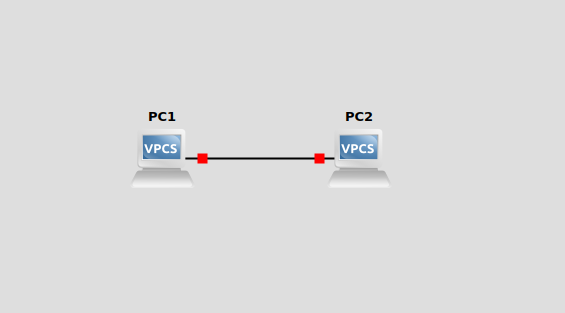
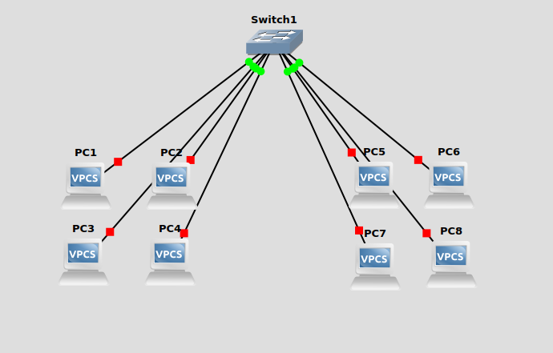
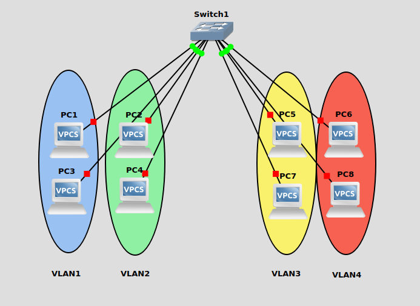
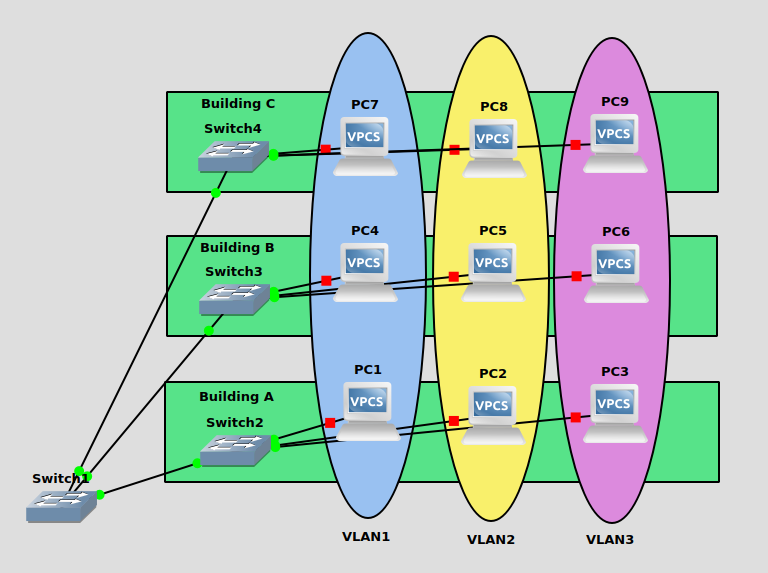
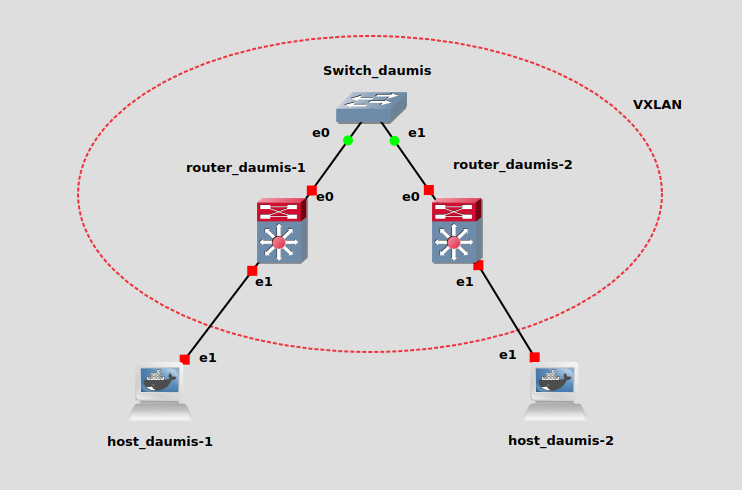
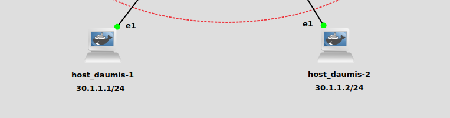

# P2 Discovering a VXLAN

## VXLAN

**VXLAN** (Virtual Extensible LAN) is a network virtualization technology that addresses the scalability limitations of traditional **VLANs** (Virtual LANs).
Let's explain quickly what a traditional **VLAN** is

### What's a VLAN

**VLAN** (Virtual Local Area Network) is a logical network made to isolate machines and make them communicate through **Ethernet**.

Below is a (really) basic network of 2 PCs communicating via Ethernet.



This is called a LAN (Local Aera Network).

If you want to extend this network and link more PCs, you are going to add a switch that connects every PCs.



Now let's say you want to segment those connections so your machines can only communicate with some others, you will have to create VLANs.



Even though every PCs are connected to the same switch, they can now only communicate with machines in their respective LAN (thanks to VLAN).

Here is a slightly more complex example and a use case of VLAN:



This is a company splitted in 3 buildings, each building has a switch that connects to PCs. We have created VLANs so that every PCs in their respective VLAN will be able to communicate with other PCs in the same VLAN even if the other PCs are located in another building.

Segmenting networks can be useful so that every team of the company possess a network of it's own and can only communicate with other members of the same field (for example HR, Marketing, Engineering etc...). It also enhances security as networks are isolated from each other, reducing potential intrusions.

### What's VXLAN

Now that you know why we use VLANs, you might want to know why we would use VXLANs.

There are plenty of use cases to explain why VXLAN exists but to keep it quite simple i will adress two here, the first one is **VLAN Identifiers Limitation**:

When you create and configure a VLAN, you have to specify a proper identifier (called VLAN ID) so the packets are well distributed between them. The number of VLANs that you can create are limited to 4096. With VXLAN the number of usable identifiers (called VNI) are extended to 16 Million, making you able to create up to 16 Millions of virtual networks.

A second thing to know about VXLAN is that it uses UDP instead of just Ethernet, which means your packets can follow IP routes. Imagine if your company has a building in America and the other one is in Europe, we would need a very long Ethernet cable to link the PCs right ? Well thanks to VXLAN you can send Ethernet frames from a PC located in America and these frames will be transfered to a PC located in Europe, just as if the two PCs were in the same network and were connected via Ethernet cable.

Long story short, VXLAN is mainly used in complex and large network configurations such as data centers while VLAN is used in small or medium sized networks.

#### How does VXLAN works ?

VXLAN relies on **VXLAN Tunnel Endpoints** (called VTEPs) for encapsulating and decapsulating Ethernet frames within UDP packets. 

Here are the processes:

- When a VTEP receives an Ethernet frame destined for a VXLAN network, a VXLAN header (which includes the VNI) and a UDP header are added to the frame, making it a VXLAN packet. This process is called **Encapsulation**.

- The **Decapsulation:** is the backwards process. Upon receiving a VXLAN packet, the designated VTEP decapsulates the VXLAN packet to retrieve the original Ethernet frame and forwards it to the destination within the VXLAN segment.

One VTEP **Encapsulates**, the other **Decapsulates**, therefore the Ethernet frame remains the same from PC1 to PC2 just like the first image of the very basic network above.

#### The exercise

In this part of the project, we are required to configure a VXLAN and two VTEPS in order to make two PCs communicate with each other.

It should look like this



## Configuration Guide

By using VXLAN we use Layer 3 (IP) communications, therefore we need to assign valid IP addresses on our VTEPs as well as our hosts.

- ##### IP Assignation Command
    ```bash
    ip address add <ip_address>/<mask> dev <interface_name>
    ```
    ##### host_daumis-1
    ```bash
    ip addr add 30.1.1.1/24 dev eth1
    ```
    ##### host_daumis-2
    ```bash
    ip addr add 30.1.1.2/24 dev eth1
    ```

And that's it for our hosts, no further configuration is required. Both have IP addresses that we will use to make ping requests.



> [!NOTE]
> The given IP addresses for both hosts are in the same subnetwork (30.1.1.0/24) for the sake of this exercice, but they could have been totally different one from the other.
> That is the whole interest of VXLAN, to make hosts communicate as if they were on the same network even if they are not in the same subnetwork.

### VTEP Configuration

For the router part, multiple steps are required. First let's Assign IP addresses to their interfaces (eth0)

- ##### Assign IP
    ##### router_daumis-1
    ```bash
    ip address add 10.1.1.1/24 dev eth0
    ```
    ##### router_daumis-2
    ```bash
    ip address add 10.1.1.2/24 dev eth0
    ```

> [!NOTE]
> The given IP addresses for both VTEPs are in the same subnetwork (10.1.1.0/24) for the sake of this exercice, but they could have been different one from the other, on condition of routing our packets correctly.

- ##### Create VXLAN Command
    ```bash
    ip link add name <vxlan_name> type vxlan id <vni> dev <device> remote <destination_ip> local <local_ip> dstport <destination_port(standard 4789)>
    ```
    ##### router_daumis-1
    ```bash
    ip link add name vxlan10 type vxlan id 10 dev eth0 remote 10.1.1.2 local 10.1.1.1 dstport 4789
    ```
    ##### router_daumis-2
    ```bash
    ip link add name vxlan10 type vxlan id 10 dev eth0 remote 10.1.1.1 local 10.1.1.2 dstport 4789
    ```
> [!NOTE]
> What happens here is we create a vxlan with an id (VNI) of 10 on the interface eth0 of the router, then we configure the destination ip and port so the frames are destined to the proper VTEP when encapsulated by our source VTEP.

> [!IMPORTANT]
> Although you can specify different names for your vxlan, the VNI has to be the same on **both** of your VTEPs. If you specify another VNI, packets going through will be lost because there is no tunnel created. 
> Remember that VNI is crucial when the **encapsulation**/**decapsulation** occurs.

- ##### Start VXLAN
    ##### router_daumis-1 & router_daumis2
    ```bash
    ip link set vxlan10 up
    ```

- ##### Create a Bridge
    ##### router_daumis-1 & router_daumis2
    ```bash
    ip link add br0 type bridge
    ```

- ##### Start the Bridge
    ##### router_daumis-1 & router_daumis2
    ```bash
    ip link set br0 up 
    ```

- ##### Control the bridges and link interfaces
    ##### router_daumis-1 & router_daumis2
    ```bash
    brctl addif br0 vxlan10          # Connect VXLAN to the bridge
    brctl addif br0 eth1             # Connect physical device (eth1) to the bridge
    ```

> [!NOTE]
> The bridges are quite self explanatory, it will serve as a link between the physical router interface (eth1) that is receiving Ethernet frames from **host_daumis-1** and the VXLAN interface.
> After decapsulation, the frame is transfered to **host_daumis-2** via the bridged interface (eth1) on the second VTEP. This works both ways.
> This also explains why we didn't need to assign any IP to eth1 during the configuration of the routers, the Ethernet frame is on Layer 2 so it doesn't need any IP address to be transferred.

And that's it ! Your machines should be able to ping each other and communicate just like if they were on the same network.

### Multicast VXLAN Configuration

Another thing required for this exercise is to implement multicasting.

Right now our VXLAN is configured in a way that each VTEP knows where to send it's packets, it's the ```remote <destination_ip>``` part in our command line when creating the VXLAN. It's good when you don't have many VTEPs and when their IP doesn't change.

Imagine having to change a hundred of VTEPs configurations just because some IP address has changed ? Nope.

This is why we have multicast groups, so the packets will be sent to a specific IP address, the multicast group address.
Each VTEP on that multicast address will recieve the packet.

The configuration process is basically the same, except the ```remote <destination_ip>``` part. The command looks like this.

- ##### Create Multicast VXLAN Command
    ```bash
    ip link add name <vxlan_name> type vxlan id <vni> dev <device> group <multicast_ip> local <local_ip> dstport <destination_port(standard 4789)>
    ```
  ##### router_daumis-1 & router_daumis2
  ```bash
  ip link add name vxlan10 type vxlan id 10 dev eth0 group 239.1.1.1 dstport 4789 
  ```

The rest of the configuration is **STRICTLY** the same.

And that concludes this part of the project, you know how to create and use VXLAN now. On to part 3!