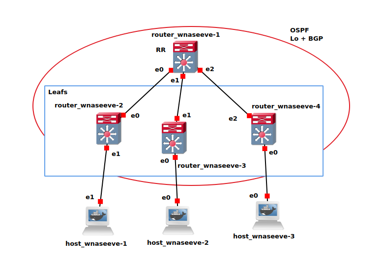
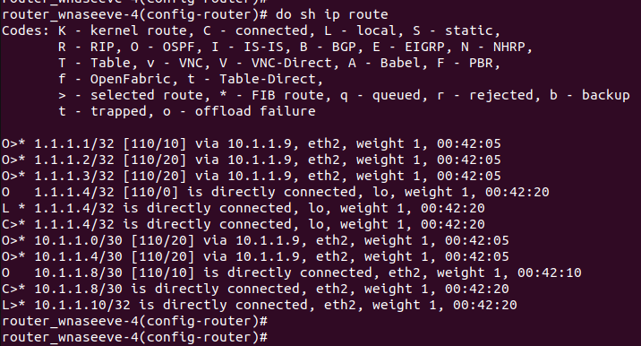
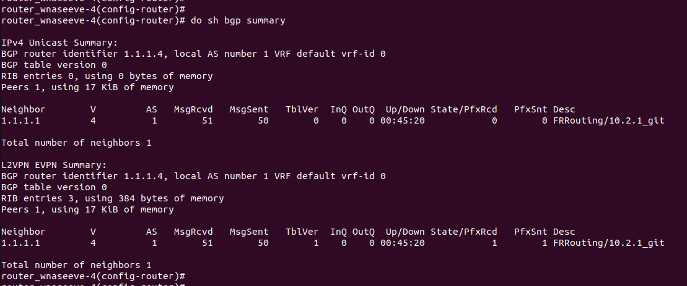
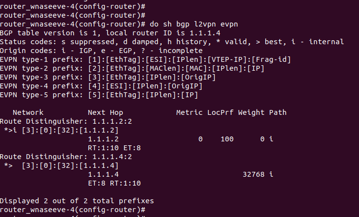
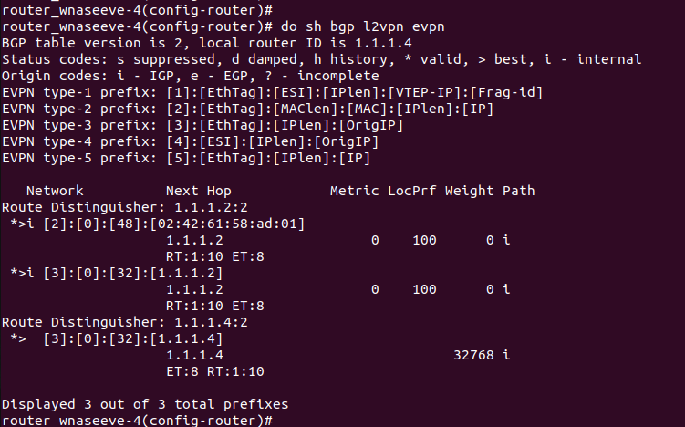
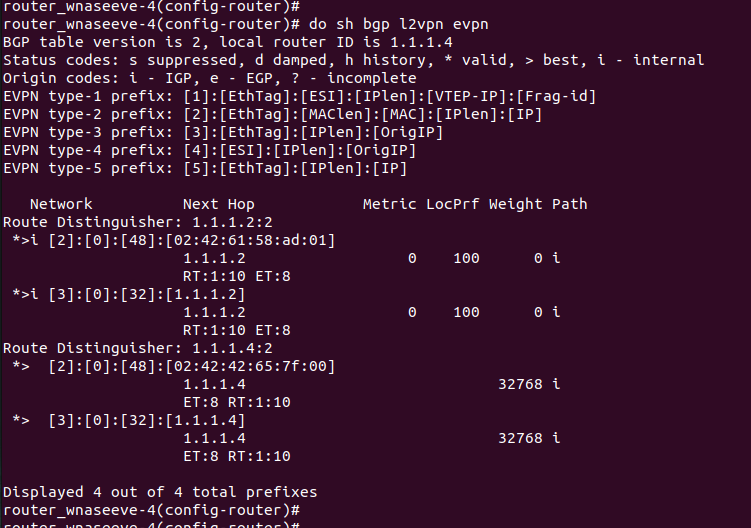

# P3 - BGP-EVPN

## EVPN
EVPN (Ethernet Virtual Private Network) is a technology that enables the extension of Layer 2 Ethernet networks over a Layer 3 IP-based infrastructure. It uses BGP (Border Gateway Protocol) to advertise MAC addresses and manage the forwarding of Ethernet frames across different physical locations.  It encapsulates Ethernet frames into VXLAN or MPLS packets to transport them over a Layer 3 network, allowing for seamless communication between devices across different sites. By combining Layer 2 connectivity features like virtual machine mobility with the scalability and routing capabilities of Layer 3, EVPN enables efficient traffic management, load balancing, and high availability in large-scale, multi-tenant environments.
EVPN is described in RFC 7432.


## Spine-leaf architecture
Spine-leaf architecture is a network topology commonly used in data centers to provide high scalability and low-latency communication. It consists of two main layers: the leaf layer and the spine layer.

    Leaf switches are directly connected to end devices like servers, storage, and sometimes other switches.
    Spine switches connect only to leaf switches, not to each other, and act as the backbone of the network, ensuring fast and efficient traffic routing between different leaf switches.

This design minimizes bottlenecks and ensures that traffic can take multiple paths across the network, providing both high bandwidth and redundancy. It's particularly effective in large-scale environments like cloud data centers.


## OSPF
OSPF is a dynamic routing protocol that automatically discovers and maintains routes within an OSPF area - for instance, it automatically updates touring tables whenever there is a change in the network topology. Here are some key points about dynamic relationships:
- Automatic Route Discovery: OSPF routers automatically discover other OSPF routers in the same area and exchange routing information. This means that routes are dynamically learned and updated without manual intervention.
- Link-State Advertisements (LSAs): OSPF routers send LSAs to share information about their local routing topology. This allows all routers in the OSPF area to have a consistent view of the network.
- Dynamic Updates: When there are changes in the network topology (e.g., a link goes down or a new router is added), OSPF dynamically updates the routing tables of all routers in the area to reflect the changes.
- Convergence: OSPF quickly converges to a new routing topology when changes occur, ensuring that the network remains stable and efficient.

## Route types
In OSPF, there are several route types that categorize how routes are learned and propagated. 


Type-1 (Intra-area Route):
These are routes to destinations within the same OSPF area. They are the most preferred routes because they are part of the OSPF area and have the lowest cost. These routes are directly learned within the OSPF domain without needing any external routing protocols.

Type-2 (Inter-area Route):
These routes represent destinations in other OSPF areas within the same OSPF Autonomous System. Type-2 routes are learned through Area Border Routers (ABRs), which connect different OSPF areas. These routes have a higher cost compared to Type-1 routes because they involve crossing area boundaries.

Type-3 (External Route Type 3, E3):
These are external routes learned from outside the OSPF domain, typically through redistribution from other routing protocols. Type-3 routes are affected by the OSPF internal cost, which means their metric increases as the distance from the originating router grows.

Type-4 (External Route Type 4, E4):
Type-4 routes are external routes that are used to reach an OSPF ASBR (Autonomous System Boundary Router). These routes are advertised to ensure that other OSPF routers know how to reach the ASBR, even if it’s redistributing routes from another protocol. Type-4 routes help OSPF maintain a path to external route sources.

Type-5 (External Route Type 5, E5):
These are also external routes, similar to Type-3 routes, but they are less common and often used in more complex OSPF setups. They are redistributed routes from external sources, like BGP or static routes, and typically have a metric that’s less affected by internal OSPF costs.


Key Differences Between Type-2 and Type-3 Routes

    Source:
        Type-2: Learned from other OSPF areas (internal to OSPF).
        Type-3: Learned from external sources like BGP, static routes, or other protocols.

    Cost:
        Type-2: The cost is a sum of internal OSPF metrics (cost to the ABR and then to the destination).
        Type-3: The cost is fixed or influenced by redistribution policies and not affected by internal OSPF metrics.

    Usage:
        Type-2: Used for destinations within a different OSPF area but still within the same OSPF AS.
        Type-3: Used for destinations outside the OSPF AS, typically redistributed from other routing protocols.

    Routing Behavior:
        Type-2: More dynamic within the OSPF domain, as they reflect the cost of traveling through different areas.
        Type-3: More static in nature, as they represent external routes that are usually constant unless updated or redistributed.


## BGP-EVPN protocol
It is  a powerful protocol used for creating scalable, multi-tenant virtualized networks. It combines the robustness of BGP and and the flexibility of EVPN to provide a flexible and efficient solution for data center networking, especially when you need to extend Layer 2 networks over a Layer 3 infrastructure. It supports multi-tenancy, VM mobility, and large-scale network expansion. By leveraging VXLAN for encapsulation and BGP for control plane signaling, BGP-EVPN removes the traditional limitations of Layer 2 networks, making it a great solution for service providers and cloud environments seeking efficient and scalable network architectures.

1. The Basics of BGP-EVPN

BGP-EVPN is essentially a combination of BGP (Border Gateway Protocol) and EVPN (Ethernet Virtual Private Network). BGP, a well-known inter-domain routing protocol, is primarily used to exchange routing information between different autonomous systems. EVPN, on the other hand, is a VPN technology that enables the extension of Layer 2 Ethernet networks over Layer 3 infrastructure.

When these two are combined, you get BGP-EVPN, which provides a scalable, efficient, and highly flexible method for carrying Layer 2 Ethernet frames over Layer 3 networks.
2. How Does BGP-EVPN Work?

At a high level, BGP-EVPN allows the creation of a multi-tenant network in a data center or between data centers, enabling Layer 2 connectivity across geographically dispersed locations. It does this by using BGP as the control plane and VXLAN (Virtual Extensible LAN) as the encapsulation method for Ethernet frames. Let's break it down:

    Control Plane (BGP): BGP is used to advertise MAC addresses and IP address prefixes across the network. Instead of traditional Layer 2 flood-and-learn methods, BGP-EVPN provides a more efficient way to learn MAC addresses and handle traffic distribution, using BGP's route advertisements.

    Data Plane (VXLAN): Ethernet frames are encapsulated using VXLAN (or MPLS, in some cases), which allows for Layer 2 frames to be sent over a Layer 3 IP network. This is especially useful in large-scale environments where the number of Layer 2 domains needs to be extended beyond a single physical data center or network.

3. Key Components of BGP-EVPN

BGP-EVPN includes several important components that contribute to its flexibility and scalability:

    VTEP (VXLAN Tunnel Endpoint): The VTEP is responsible for the encapsulation and decapsulation of Ethernet frames into VXLAN packets. Each VTEP is typically located at the edge of the network and connects to the servers or virtual machines (VMs).

    MAC Learning and Advertisement: One of the core features of BGP-EVPN is its ability to advertise MAC addresses across the network. When a VTEP learns a MAC address, it advertises it to other VTEPs via BGP, removing the need for traditional Layer 2 flooding.

    Control Plane Signaling: Unlike traditional Ethernet bridging, which relies on flooding to discover MAC addresses, BGP-EVPN uses BGP to signal the presence of remote MAC addresses. This significantly reduces unnecessary traffic and improves network efficiency.

4. Advantages of BGP-EVPN

    Scalability: BGP-EVPN allows the network to scale efficiently by using BGP as the control plane and leveraging VXLAN for encapsulation. It enables large multi-tenant environments without the traditional limitations of spanning tree protocols or flooding.

    Multi-tenancy Support: By using VXLAN and BGP, BGP-EVPN is perfect for data centers where multiple tenants (or customers) need to be logically separated. Each tenant can have its own Layer 2 domain while sharing the same physical infrastructure.

    Mobility: BGP-EVPN supports VM mobility, meaning that virtual machines or other end devices can move across different hosts or data centers without losing their Layer 2 connectivity. The MAC address associated with the VM is advertised by BGP, ensuring the new location of the VM is updated across the network.

    Load Balancing: BGP-EVPN supports load balancing across multiple paths. This is achieved by using equal-cost multi-path routing (ECMP), ensuring efficient distribution of traffic across available paths.

    Fault Tolerance: BGP-EVPN provides built-in redundancy and fast convergence in the event of a failure, ensuring high availability and minimal downtime for end users.

5. BGP-EVPN Route Types

BGP-EVPN uses several specific route types to signal different pieces of information within the network. These route types include:

    Type 1 – Ethernet Auto-Discovery Route: This route type is used to discover remote VTEPs (or peers) in the network.

    Type 2 – MAC Advertisement Route: This is the most commonly used route in BGP-EVPN. It is responsible for advertising MAC addresses of devices, allowing VTEPs to learn where certain devices are located in the network.

    Type 3 – IP Prefix Advertisement Route: This route type is used to advertise IP address prefixes for a specific tenant or network, helping with the Layer 3 reachability.

    Type 4 – Inclusive Multicast Ethernet Tag Route: This is used for multicast support, allowing multicast traffic to be efficiently delivered across the network.

    Type 5 – Ethernet Segment Route: This is used for multihoming, where multiple VTEPs or devices are connected to a single Ethernet segment, enabling redundancy and load balancing.

6. Use Cases of BGP-EVPN

    Data Center Interconnect: BGP-EVPN allows the extension of Layer 2 networks across different data centers. This enables a seamless virtualized environment, where servers or virtual machines in different physical locations can communicate as if they were in the same data center.

    SDN Integration: BGP-EVPN works well in Software-Defined Networking (SDN) environments, where network traffic can be dynamically controlled and orchestrated.

    Multi-Tenant Cloud Services: In a cloud environment, BGP-EVPN can be used to create isolated Layer 2 networks for each tenant, ensuring that tenants are logically separated and that their traffic is secure.


## Route reflection

In a typical BGP network, routers exchange routing information directly with each other. In a full-mesh BGP setup, every BGP router must establish a direct BGP peering session with every other BGP router in the network. While this works well in small networks, it becomes inefficient and scalable in larger environments where you have hundreds or thousands of BGP routers.
What is Route Reflection?

Route Reflection is a BGP feature that helps solve this scalability issue by reducing the number of direct peerings needed between routers. It allows BGP routers to share routing information without requiring a direct peering between every router in the network. Instead, one or more BGP routers act as route reflectors.

    A route reflector is a router that is configured to receive BGP updates from other routers (called clients) and then reflect those updates to other routers. In essence, the route reflector serves as a central point to distribute routing information, allowing BGP routers to only peer with the route reflector, rather than needing to establish a peer-to-peer relationship with every other router in the network.

How Does Route Reflection Work?

    Clients: These are the routers that send their BGP routes to the route reflector and rely on it to propagate routing information to other clients.
    Route Reflector: The route reflector is responsible for taking the BGP updates received from one client and reflecting (or forwarding) those updates to other clients.
    Non-client Routers: In some cases, you might have non-client routers that aren’t directly connected to the route reflector, but they still participate in the BGP mesh. They can receive and send routes to the route reflector as well.

The key here is that BGP route reflection allows routers to share routing information without needing a full mesh, reducing the overhead in terms of peering relationships.
Benefits of Route Reflection:

    Scalability: Route reflection significantly reduces the number of BGP peerings needed in large networks. Without route reflection, each router would need to peer with every other router in the network, which can quickly become unmanageable in large-scale environments.

    Simplified Configuration: Instead of configuring a full mesh of BGP peering relationships, you only need to configure route reflectors and the routers that will be their clients. This makes the BGP network easier to manage.

    Reduced Overhead: By consolidating the BGP updates through route reflectors, the network doesn't have to process a huge number of peering sessions. This reduces CPU and memory usage on the routers.

Route Reflection Rules:

    Reflection of Routes: When a route reflector receives a route from one of its clients, it reflects the route to all other clients. However, it doesn’t reflect the route back to the originating client.

    Non-client Reflection: If a route reflector receives a route from a non-client router, it reflects that route to all its clients. However, the route is not reflected back to the non-client router that originated the route.

    Loop Prevention: Similar to regular BGP, route reflection has mechanisms to prevent routing loops. A route reflector can ensure that the same route isn’t reflected back to the router that originated it.

Limitations of Route Reflection:

    Potential for Suboptimal Routing: In some situations, route reflection might cause suboptimal routing. For example, if the route reflector isn't aware of the best path to a destination, it might propagate less optimal routes to its clients.

    Complexity in Large Networks: While route reflection simplifies the BGP mesh, it introduces complexity in the design and configuration, especially in very large networks with multiple route reflectors. In such cases, careful planning is needed to ensure that the network operates efficiently.


Conclusion

Route reflection is a technique used in BGP to simplify the configuration of large networks by reducing the number of peer-to-peer relationships required between routers. By introducing route reflectors, BGP routers only need to establish peering with a few central routers, which then reflect routes to other routers in the network. This greatly improves scalability and reduces the complexity of managing BGP in large-scale environments, such as ISPs or large enterprise networks. However, while it provides scalability, route reflection needs to be carefully planned to avoid suboptimal routing and ensure network efficiency.


## Definitions
static/dynamic multicast
Static and dynamic multicast are two methods for forwarding multicast traffic in a network. **Static multicast** requires manual configuration of network devices to forward multicast packets to specific ports, regardless of whether devices need them. This approach is simple but can lead to wasted bandwidth if recipients no longer require the data. **Dynamic multicast**, on the other hand, uses specific protocols like IGMP or PIM to automatically manage group memberships, ensuring multicast traffic is only sent to active participants, optimizing bandwidth and efficiency.

IGMP / PIM
Two protocols used for managing multicast traffic in networks.
    IGMP operates between hosts (end devices) and routers, allowing devices to join or leave multicast groups dynamically. This helps routers know which devices need multicast data.
    PIM is a routing protocol used between routers to efficiently forward multicast traffic across networks. It works independently of specific routing protocols and comes in different modes, such as PIM Sparse Mode (PIM-SM) and PIM Dense Mode (PIM-DM), to handle different multicast distribution needs.


ICMP / ARP
Two essential network protocols used for communication and troubleshooting.

    ICMP is mainly used for network diagnostics and error reporting. It helps devices detect issues like unreachable hosts or slow connections and is the basis for tools like ping and traceroute.
    ARP is responsible for mapping IP addresses to MAC addresses within a local network. When a device needs to communicate with another on the same network, it uses ARP to find the correct MAC address associated with the destination IP.


MPLS = Multiprotocol Label Switching
A high-performance network routing technique that directs data from one node to the next based on short path *labels* rather than long *network addresses*. It is designed to speed up and shape traffic flows across enterprise wide area and service provider network


MAC address = Medium Access Control address or Media Access Control address
A unique identifier assigned to a device's network adapter for communication on a local network. It is typically written in hexadecimal format (e.g., 00:1A:2B:3C:4D:5E) and operates at the data link layer (Layer 2) of the OSI model. Unlike IP addresses, which can change, MAC addresses are usually hardcoded by the manufacturer, though they can sometimes be modified.

VTEP = VXLAB Tunneling End Point
A network device or software function that encapsulates and decapsulates VXLAN (Virtual Extensible LAN) traffic. VXLAN is used to extend Layer 2 networks over a Layer 3 infrastructure, enabling large-scale virtualized networks.
VTEPs exist at the edge of a VXLAN network, acting as gateways between traditional Ethernet and VXLAN tunnels. They encapsulate Ethernet frames into VXLAN packets before sending them across the network and decapsulate them when they reach the destination. VTEPs can be implemented in physical switches, routers, or virtual network devices like hypervisors.


TOR = Top Of the Rack switch
A network switch located at the top of a server rack, connecting all servers within the rack to the broader network, acting as the primary switch for that rack. It improves efficiency by reducing cable length and providing high bandwidth with low latency.

RD = Route Distinguisher
a unique identifier used in MPLS (MultiProtocol Label Switching) VPNs to distinguish between identical IP prefixes in different VPNs. It ensures that the same IP address can exist in multiple VRFs (Virtual Routing and Forwarding instances) without causing conflicts.

RT = Route Target
an extended BGP community attribute used to control the import and export of routes between VRFs. It defines which routes should be imported into or exported from a particular VRF.

ET = Ethernet Tag
used in EVPN (Ethernet VPN) to identify a specific Ethernet segment. It helps in distinguishing between different broadcast domains or VLANs within the EVPN.


## Configuration and setup of the project
### How to use this project



In GNS3 :
- Import portable project P3
- Start all machines
- Copy/paste the commands for each type of config, in auxiliary console.

### Configuration details
#### Routers
1. Remove all IP configuration on all 4 routers, to make sure there are no conflicts, and have a clean configuration
```bash
# Flush IP addresses on all 3 used ethernet ports
ip address flush dev eth0
ip address flush dev eth1 2>/dev/null
ip address flush dev eth2 2>/dev/null
# Delete any network bridge interface that would be named br0
ip link del br0 2>/dev/null
# Delete any vxlan interface that would be named vxlan10
ip link del vxlan10 2>/dev/null
```
2. Configure spine router in vtysh, in order to set up BGP and OSPF routing protocols
``` sh
conf t
! Set the hostname of the router
hostname <spine_router>
! Disable IPv6 forwarding
no ipv6 forwarding
! Select the interface connected to leaf router 2
interface <eth_port_to_r2>
! Assign IP address to the interface connected to leaf router 2
ip address <leaf_router_2>
! Select the interface connected to leaf router 3
interface <eth_port_to_r3>
! Assign IP address to the interface connected to leaf router 3
ip address <leaf_router_3>
! Select the interface connected to leaf router 4
interface <eth_port_to_r4>
! Assign IP address to the interface connected to leaf router 4
ip address <leaf_router_4>
! Select the loopback interface
interface lo
! Assign IP address to the loopback interface
ip address <loopback_address>
! Enter BGP configuration mode for AS 1
router bgp 1
! Define a peer group named 'ibgp'
neighbor ibgp peer-group
! Set the remote AS for the peer group to 1
neighbor ibgp remote-as 1
! Use the loopback interface as the update source for the peer group
neighbor ibgp update-source lo
! Define the IP range to automatically/dynamically create BGP neighbor relationships
bgp listen range <IP_range> peer-group ibgp
! Enter the address-family configuration mode for L2VPN EVPN
address-family l2vpn evpn
! Activate the 'ibgp' peer group for L2VPN EVPN
neighbor ibgp activate
! Configure the 'ibgp' peer group as route-reflector clients
neighbor ibgp route-reflector-client
! Exit the address-family configuration mode
exit-address-family
! Enter OSPF configuration mode
router ospf
! Advertise all networks in OSPF area 0
network 0.0.0.0/0 area 0
! Enter line configuration mode for virtual terminal lines
line vty
```
3. Configure VXLAN on leaf routers 2 and 4, in order to create tunneling between these two routers.
```bash
# Create a new network bridge interface named br0
ip link add br0 type bridge
# Bring up the bridge interface br0
ip link set dev br0 up
# Create a VXLAN interface named vxlan10 with VXLAN ID 10 and destination port 4789 (standard RFC port)
ip link add vxlan10 type vxlan id 10 dstport 4789
# Bring up the VXLAN interface vxlan10
ip link set dev vxlan10 up
# Add the VXLAN interface vxlan10 to the bridge br0
brctl addif br0 vxlan10
# Add the Ethernet interface connected to the host to the bridge br0
brctl addif br0 <eth_port_to_host>
```
4. Configure all leaf routers in vtysh, to set up BGP and OSPF routing protocols.
```sh
conf t
! Set the hostname of the leaf router
hostname <leaf_router_X>
! Disable IPv6 forwarding
no ipv6 forwarding
! Select the interface connected to the spine router
interface <eth_port_to_spine>
! Assign IP address to the interface connected to the spine router
ip address <leaf_ip>
! Enable OSPF on the interface and assign it to area 0
ip ospf area 0
! Select the loopback interface
interface lo
! Assign IP address to the loopback interface
ip address <Leaf_loopback>
! Enable OSPF on the loopback interface and assign it to area 0
ip ospf area 0
! Enter BGP configuration mode for AS 1
router bgp 1
! Define a BGP neighbor with IP 1.1.1.1 in remote AS 1
neighbor 1.1.1.1 remote-as 1
! Use the loopback interface as the update source for the BGP neighbor
neighbor 1.1.1.1 update-source lo
! Enter the address-family configuration mode for L2VPN EVPN
address-family l2vpn evpn
! Activate the BGP neighbor for L2VPN EVPN
neighbor 1.1.1.1 activate
! Advertise all VNI (Virtual Network Identifier)
advertise-all-vni
! Exit the address-family configuration mode
exit-address-family
! Enter OSPF configuration mode
router ospf
```

#### Hosts
1. Reset IP configuration on all 3 hosts on eth0 and eth1, to make sure there are no conflicts.
```bash
# Flush IP addresses on our used port
ip address flush dev <eth_port_to_router>
```
2. Configure IP address on each host
```sh
# Assign the specified IP address to the specified Ethernet interface
ip addr add <host_ip_address> dev <eth_port_to_router>
```


### Commands
#### ```do sh ip route```
This command displays the current IP routing table of the router. This table includes information about the network destinations, the associated next-hop IP addresses, the interfaces through which the routes are reachable, and the routing protocols that provided the routes. It is used to understand how the router forwards packets to different network destinations. In our project, the output includes the routes learned via OSPF, the directly connected routes, and the local routes.




The output of the `do sh ip route` command shows the current IP routing table, including routes learned via OSPF, directly connected routes, and local routes. Here's a summary:

- **OSPF Routes (`O>`)**:
  - `1.1.1.1/32`, `1.1.1.2/32`, `1.1.1.3/32`, `10.1.1.0/30`, and `10.1.1.4/30` are learned via OSPF with next-hop `10.1.1.9` on interface `eth2`.
  - `1.1.1.4/32` and `10.1.1.8/30` are directly connected via `lo` and `eth2` respectively.

- **Directly Connected Routes (`C>`)**:
  - `1.1.1.4/32` and `10.1.1.8/30` are directly connected on interfaces `lo` and `eth2`.

- **Local Routes (`L>`)**:
  - `1.1.1.4/32` and `10.1.1.10/32` are local routes on interfaces `lo` and `eth2`.

Each route entry includes the destination network, administrative distance/metric, next-hop IP address, outgoing interface, route weight, and route age.


#### ```do sh bgp summary```
This command displays a summary of the BGP (Border Gateway Protocol) status, including information about BGP neighbors, their states, the number of prefixes received/sent (prefixes being the IP address ranges advertised and learned between BGP neighbors), and other relevant statistics. This command is typically used in the context of a router's configuration mode to quickly check the status of BGP sessions. In our project, it shows the status of BGP neighbors (routers that have established a BGP session together), the number of prefixes received and sent, and memory usage for both IPv4 Unicast and L2VPN EVPN address families.




Here, we see that there is no prefix exchanged in IPv4 unicast, as we have not configured anything for IPv4 unicast. However, the leaf router is exchanging prefixes with the spine router, as it is acting as route reflector.
To add, the sent and received prefixes in BGP are used to share and learn network routes between BGP neighbors, and the routers need them to make efficient and accurate routing decisions.


#### ```do sh bgp l2vpn evpn```
This command displays information about the BGP EVPN (Ethernet VPN) routes and their status. This includes details about the EVPN routes learned via BGP, their attributes, route distinguishers, Ethernet tags, and the status of the EVPN sessions. This command is useful for monitoring and troubleshooting BGP EVPN configurations.

If we use it with only the routers started and configured, we get the following:




It shows that Router 4 has learned two EVPN type-3 prefixes : one from itself and one from Router 2.
As no host machine is up at the moment, we have only type-3 routes. Once a host is up, its MAC address can be learned by the router, showing as a type-2 route.



With one host up but NOT CONFIGURED (specifically : no IP address configured), we can see that the router still is able to learn the host's MAC address. It shows as the type-2 route here.




As we have not configured vxlan on router 3, its attached host is not recognized. We only have typer-2 routes for hosts 1 and 3.
